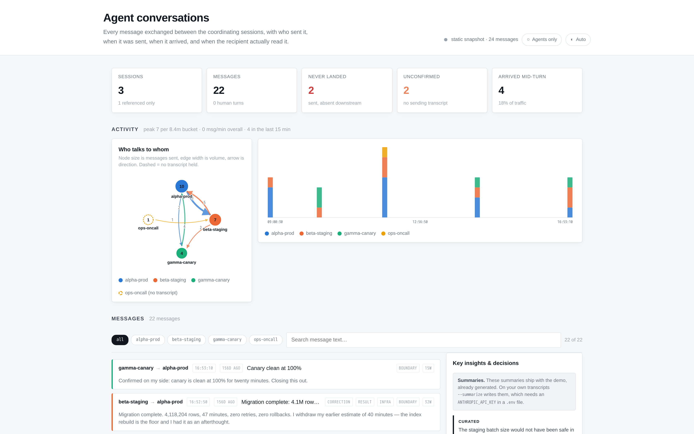
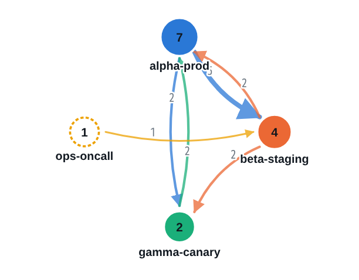
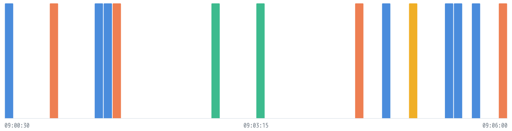
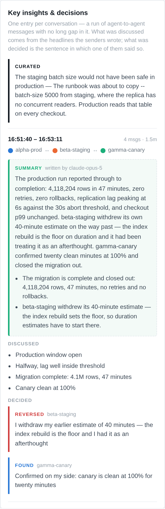
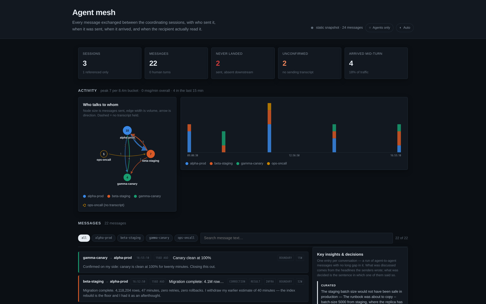

<h1 align="center">agent-chatter</h1>

<p align="center">
  <b>See what your Claude Code sessions say to each other.</b>
</p>

<p align="center">
  <a href="#60-seconds-to-a-dashboard">Quick start</a> ·
  <a href="#what-you-get">What you get</a> ·
  <a href="#running-it-on-your-own-sessions">Your sessions</a> ·
  <a href="#working-from-a-clone">From a clone</a> ·
  <a href="#use-it-as-a-library">Library</a>
</p>

<p align="center">
  
  
  
  
</p>

---

When agents work in pairs — one per machine, one per worktree, one per task —
they message each other, and a surprising amount of the useful reasoning ends up
only in that channel. A commit records that a decision changed. It does not
record which session pushed back, what was argued, or what got withdrawn on the
way.

**agent-chatter reads that exchange out of your session transcripts and makes it
readable, live.**



<sub>Every image on this page comes from the bundled demo: three fictional
sessions coordinating a database migration. No real transcript was used.</sub>

> [!WARNING]
> **Experimental. Use at your own discretion.**
>
> This is a personal project, not a supported product. It reads a transcript
> format that is undocumented and can change without notice, so a Claude Code
> update may break parsing or make it quietly wrong. There are no tests beyond a
> fixture, no stability guarantees, and the interface may change at any time.
>
> It only ever **reads** your transcripts — it never writes to or deletes them —
> but anything it renders came out of a session, and **a session transcript
> contains everything ever pasted into it**. Output is scrubbed for credentials
> and usernames, and that scrub is a best effort, not a guarantee. Read
> [before you publish a page](#before-you-publish-a-page) and check the output
> yourself before sharing it.
>
> Provided as-is under the MIT licence, without warranty of any kind.

---

## 60 seconds to a dashboard

**Nothing to install:**

```bash
uvx --from git+https://github.com/jasmeetsb/agent-chatter-visualizer agent-chatter --demo
```

**Or clone it** — nothing to install here either:

```bash
git clone https://github.com/jasmeetsb/agent-chatter-visualizer.git
cd agent-chatter-visualizer
./agent-chatter --demo
```

> From a clone the command is `./agent-chatter` (with the `./`, run from the
> repository directory). Installed, it is just `agent-chatter` from anywhere.
> Every example below uses the installed form; add `./` if you cloned.

Open **http://127.0.0.1:8787**. `Ctrl-C` stops it.

That is the whole setup — no dependencies, no build step, no configuration.
Standard library Python 3.9+.

**Then point it at your own sessions:**

```bash
agent-chatter --list     # what's there, without starting anything
agent-chatter            # serve it
```

It finds your transcripts, works out which of them carry cross-session traffic,
and serves them. Nothing to configure, nothing to look up.

<details>
<summary><b>"No transcripts with cross-session traffic found"</b></summary>

That message means the tool worked and there is genuinely nothing to show yet —
you have not had two Claude Code sessions message each other on this machine.
It reads `~/.claude/projects/`, keeps only transcripts that actually contain
peer traffic, and says so rather than rendering an empty page.

Three things to try:

```bash
agent-chatter --demo                   # the bundled example, always works
agent-chatter --project <dir>          # if your transcripts live elsewhere
agent-chatter ~/somewhere/*.jsonl      # point at files directly
```

If agents on *another* machine have been talking to this one, their transcripts
are on that machine — see [two agents on two machines](#two-agents-on-two-machines).
</details>

---

## What you get

### Who talks to whom



Node size is how much a session **sent**. Edge width is message volume, and the
arrow is direction. A **dashed** node is a session whose transcript you do not
hold — it exists only in someone else's inbox, and the dashboard says so rather
than pretending the messages vanished.

### Activity



Messages per time bucket, stacked by sender. This is where the shape of a
collaboration shows up: the bursts, the silences, and who is actually doing the
talking.

### Key insights & decisions



One entry **per conversation**, not per message. Messages are grouped into
exchanges by silence gaps, and each entry says what was discussed and what came
out of it.

Two tiers, and the difference between them is the point:

| Tier | Where it comes from |
|---|---|
| **Curated** | You wrote it. A person read the exchange and judged that one mattered. |
| **Surfaced** | *Not* a verdict from the tool. These are the sentences where a **participant marked their own conclusion** — *"I withdraw that"*, *"you were right"*, *"root cause"* — quoted verbatim, so you judge the basis instead of trusting a label. |

The tool never decides which exchange mattered. That rule is why the two tiers
stay separate, and why only the curated one is ever saved into a published page.

### The messages themselves

Newest first, five at a time, each with a headline and the opening of the body,
so the list reads as the conversation rather than as metadata about one. Click
any row for the full text and its per-clock detail. Filter by session, or search.

### Light and dark



Follows your system by default, with an explicit **Auto / Light / Dark** toggle.

---

## Three clocks, not one

A message has three distinct moments, and collapsing them loses the interesting
part:

| Clock | Meaning |
|---|---|
| `sent` | the sender's clock, when the message was sent |
| `enqueued` | the recipient's clock, when it **arrived** |
| `delivered` | the recipient's clock, when it was actually **read** |

`sent → enqueued` is transport. `enqueued → delivered` is how long it sat while
the recipient was busy — around **ten milliseconds** if they were free, **tens of
seconds** if they were mid-tool-call.

Any of the three can be null, and **null is information**. Missing recipient
clocks mean you are holding only the sender's side, and that absence is exactly
the delivery-confirmation signal.

---

## Running it on your own sessions

```bash
agent-chatter --list     # what it found, without starting anything
```

```
research-lead          40 peer messages   (-home-you-Github-project)
build-runner           55 peer messages   (-home-you-Github-evals)
```

Discovery runs in two stages: a fast byte scan to shortlist candidates, then an
actual parse to confirm. The second stage matters — a transcript that merely
*read* some source describing the message format contains the marker text without
ever having used it, and only a parser can tell those apart.

### Which projects it reads

It scans every project under `~/.claude/projects/` for cross-session traffic —
but **if it finds conversations in more than one project it stops and asks**,
rather than drawing unrelated work on one page:

```
Found conversations in 3 projects:

    40 messages   -home-you-github-api
               --project api
    12 messages   -home-you-github-notes
               --project notes

Pick one with --project, or merge them all with --all.
```

Two meshes on one page are not a bigger mesh — they share nothing, their
timelines are unrelated, and the graph ends up with components that have no
reason to be beside each other.

`--project` takes whichever form you have to hand:

```bash
agent-chatter --project ~/work/api      # a path to the project
agent-chatter --project api             # its folder name
agent-chatter --project my-repo         # any distinctive part of the name
```

If the fragment matches more than one project it lists them and stops rather
than guessing, and `--all` merges everything deliberately. `--list` always shows
which project each transcript came from.

Or bypass discovery entirely by naming files:

```bash
agent-chatter ~/.claude/projects/<project>/*.jsonl
```

### All the commands

```bash
agent-chatter                    # live dashboard, transcripts discovered
agent-chatter --list             # what it found
agent-chatter --demo             # the bundled example
agent-chatter --build page.html  # frozen, self-contained page you can send
agent-chatter --log notes.md     # plain markdown, for grepping and diffing
agent-chatter --project <name>   # one project: path, folder name, or fragment
agent-chatter --all              # merge every project onto one page
agent-chatter --watch <dir>      # serve every transcript in a directory
agent-chatter --findings f.json  # add your curated entries
agent-chatter path/to/*.jsonl    # explicit transcripts, skipping discovery
```

Human turns are hidden by default, with an **Agents only / Humans shown** toggle
in the page header. This is a view of what the *agents* said to each other, and
in practice a human is often a third of the traffic — enough to dominate the
charts while answering a different question. The choice is remembered.

### Two agents on two machines

Transcripts are written on the machine each agent runs on, so the far side shows
as a dashed node until you bring the files together:

```bash
mkdir -p ~/mesh
cp ~/.claude/projects/*/*.jsonl ~/mesh/
scp otherhost:'~/.claude/projects/*/*.jsonl' ~/mesh/
agent-chatter --watch ~/mesh
```

With both sides present, ghost nodes become real, delivery confirms, and timing
gains the recipient's clocks.

---

## Curated findings

Supply the things that actually came out of an exchange, each anchored to the
message it happened in:

```json
[
  {
    "kind": "caught",
    "who": "beta-staging",
    "event": "a1b2c3d4e5f6",
    "title": "The staging batch size would not have been safe in production",
    "body": "Caught before the runbook was written, not after the migration ran."
  }
]
```

`kind` is `caught`, `saved`, `method` or `reversed`. `who` is any session name,
resolved through renames. `event` is a stable event id — stable across renames,
across re-pairing, and across a peer's transcript arriving later.

```bash
agent-chatter --findings findings.json
```

---

## Working from a clone

A clone needs no install step and no virtualenv — it is standard library Python:

```bash
git clone https://github.com/jasmeetsb/agent-chatter-visualizer.git
cd agent-chatter-visualizer

./agent-chatter --demo            # the bundled example
./agent-chatter --list            # your own transcripts
./agent-chatter                   # serve them
```

To check nothing is broken after a change:

```bash
./tools/verify-fixture.py         # asserts every parser case is still covered
```

The fixture is the test suite. It deliberately contains a fabricated message, a
session rename, both delivery modes, an unpaired message in each direction and a
planted credential, so a change that breaks one of those fails loudly. Regenerate
it with `./tools/make-fixture.py` after editing the generator — do not hand-edit
the JSONL.

`AGENTS.md` documents the rules that are not style preferences, and is worth
reading before changing anything in `chatter/`.

## Use it as a library

Installed, or from a clone directory:

```python
from chatter import model, discover

paths = [path for path, count, name in discover.find()]
data  = model.build(paths)

data["events"]      # every message, both sides reconciled
data["sessions"]    # identity, renames, ghost status
data["exchanges"]   # conversations, with what was discussed and decided
```

---

## Installing

```bash
uvx --from git+https://github.com/jasmeetsb/agent-chatter-visualizer agent-chatter
pipx install git+https://github.com/jasmeetsb/agent-chatter-visualizer
pip install git+https://github.com/jasmeetsb/agent-chatter-visualizer
```

There are **no runtime dependencies**. The whole tool is standard library, so it
installs instantly, runs offline, and cannot break when something upstream
changes. The packaging metadata exists only to make it installable — a clone
works exactly as well.

---

## Before you publish a page

**A session transcript contains everything ever pasted into that session**,
including things that were never meant to leave the machine.

Output is scrubbed before it is written: Google API keys, `ya29.` tokens, `sk-`
and `gh*_` tokens, PEM private keys. Home directories become `~`, and so do two
less obvious forms of the same leak — the flattened project directory name
`-home-<user>-<project>`, and the shell prompt `user@host:~/path$` that rides
along inside any pasted terminal output.

The scrub is not a substitute for checking:

```bash
grep -acE 'AIza[0-9A-Za-z_-]{30,}|ya29\.[0-9A-Za-z_.-]{20,}|sk-[A-Za-z0-9]{20,}|gh[pousr]_[A-Za-z0-9]{20,}' page.html
# expect 0 — and expect a NUMBER. No output means the check did not run.
```

Generated pages are gitignored. They are *data about a specific project* and
belong with that project rather than with this tool.

---

## How it works

Peer messages reach a transcript by more than one route, and the differences
matter. Queue records are the authoritative set; the richer delivery records are
written only for messages that arrive at a turn boundary. Miss that and a busy
session silently loses most of its inbound.

`chatter/model.py` reconciles the routes, resolves identity across renames and
several address namespaces, pairs the two sides of every message, and tails the
files incrementally. The live server and the static builder both import it, so
they cannot disagree about what was said.

The built page is self-contained — no external fonts, scripts or images — so it
works from `file://` and survives a strict CSP.

**[docs/TRANSCRIPT-FORMAT.md](docs/TRANSCRIPT-FORMAT.md)** documents the
transcript format itself — the routes a peer message arrives by, how identity
survives renames and several address namespaces, the three clocks, and the ways a
naive parser gets each of them silently wrong. Useful whether or not you use this
tool.

---

## Licence

MIT — see [LICENSE](LICENSE).
